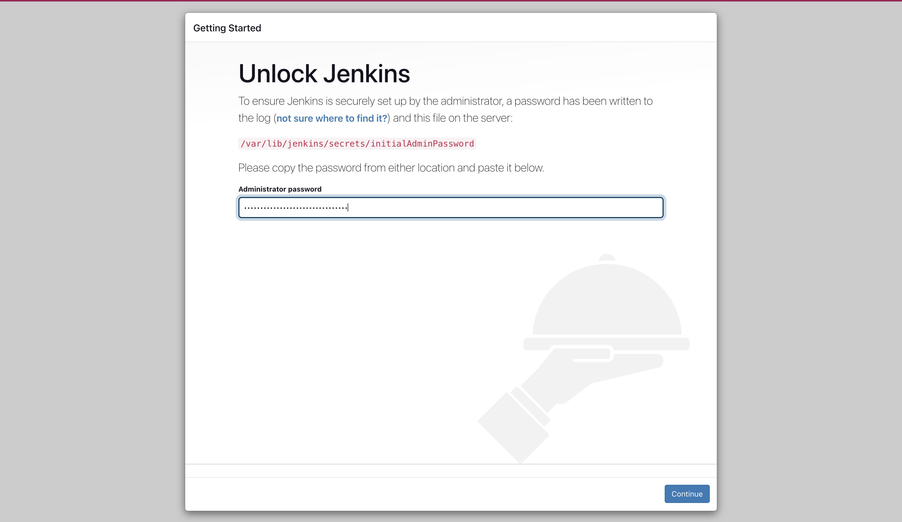
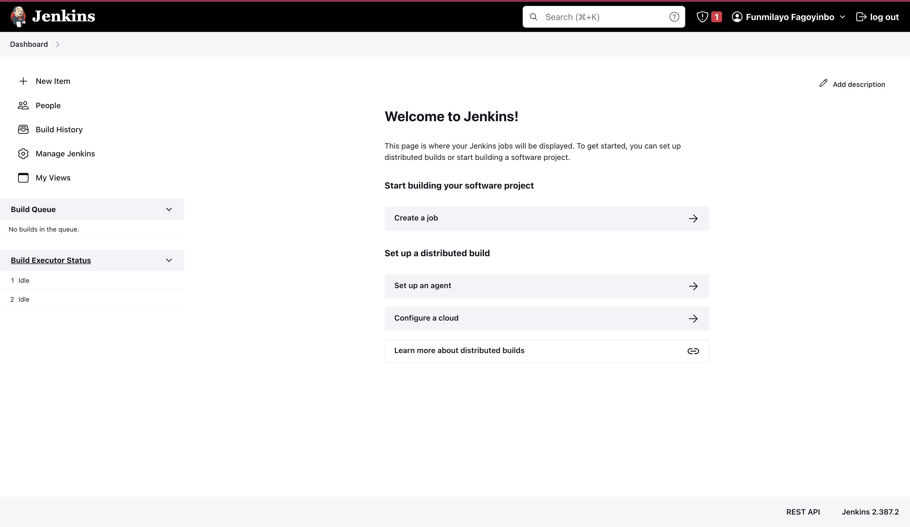

# <b>Setting up the jenkins server using terraform</b>

## Steps required to set up the Jenkins server are listed below:

### <b>Configuring the backend for tfstate files.</b>

Configure S3 Bucket as Terraform Backend by creating S3 Bucket, Policy, and DynamoDB Table in the desired region.

I worked with this [article](https://www.golinuxcloud.com/configure-s3-bucket-as-terraform-backend/) to set it up.

Note the command to get the AWS caller identity on the console is:
```
aws sts get-caller-identity
```

### <b>Provisioning and Configuring the Server.</b>
1. Create a key-pair for the jenkins-server.

2. To get the description of the ec2 image for the data resource block:

```
aws ec2 describe-images --image-ids ami-01c7ecac079939e18 --region us-east-
1
```

3. Create a script to be passed as userdata for the configuration of the jenkins server after the infrastructure has been provisioned.

4. Create the terraform scripts to provision the jenkins server. Remembering to create in a VPC.

4. Use the `terraform init`, `terraform plan`, and `terraform apply` commands to provision and configure the server.

After the creating the jenkins server with terraform, the resulting page at the URL:8080 address gave the image below:



### <b>Authenticate the Jenkins server and set up the Account.</b>

1. Connect to the server to retrieve the password from `/var/lib/jenkins/secrets/initialAdminPassword` file and install the suggested plugins from the next page.

2. Fill the form page to configure and gain access into the account.

3. This gave access into the Jenkins dashboard as shown below:



4. Click on the `Manage Jenkins` tab on the left pane to add github credentials.

Setting the credentials:


Create a new pipeline on jenkins by clicking on `New Item` insert the source code management script credentials to create a pipeline on github.

Two pipelines were created:
The `create-cluster` and the `deployment-pipeline` pipelines.


## <b>Images of the resources created on AWS:</b>


## <b>Output showing kubectl commands:</b>


## <b>Images of the pipeline builds:</b>


## <b>Images of app front-end:</b> 


## <b>jenkin-destroy-pipelines: </b>


